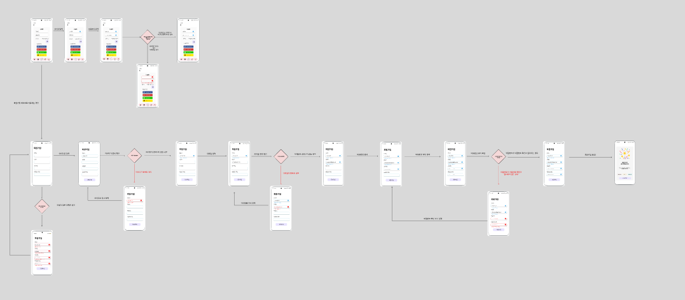
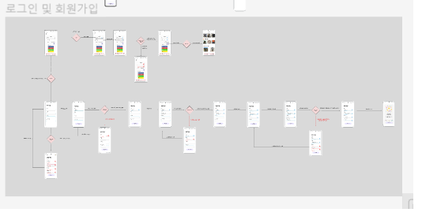
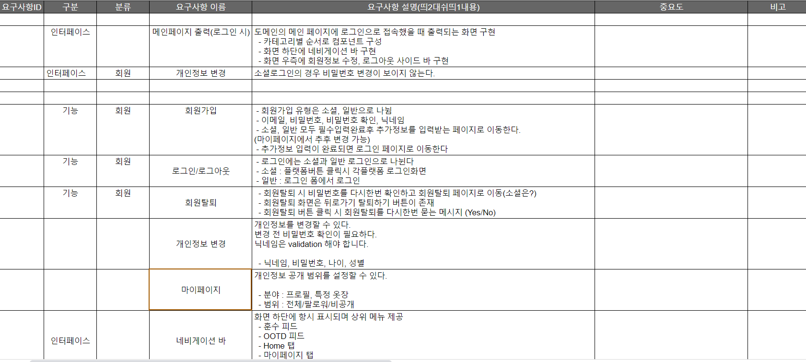

## 2023-01-18(수)

- 기술 아키텍쳐 완성

## 2023-01-19(목)

- 유저플로우 작성(미완)
  

## 2023-01-18(수)

- 유저플로우 완성
  
  

- 요구사항 명세 작성(미완)

## 2023-01-25(수)

- ppt 발표 자료 준비

## 2023-01-26(목)

- ppt 발표 자료 준비 완료

## 2023-01-27(금)

- 프론트 폴더 구조 및 URL 초안 작성

## 2023-01-30(월)

- 프론트 메인페이지, ootd페이지

## 2023-01-31(화)

- OOTD페이지 초안 완성

## 2023-02-03(금)

- 비밀번호 확인 페이지, 비밀번호 완료 페이지, 

## 2023-02-06(월)

- 훈수 메인페이지, 훈수 사진 등록 페이지, OOTD 등록페이지 완료

## 2023-02-07(화)

- 공개범위 설정 페이지, OOTD 댓글페이지

## 2023-02-08(수)

- 훈수하기 페이지 생성

## 2023-02-09(목)

- 훈수페이지 엑시오스 생성과 조회 성공