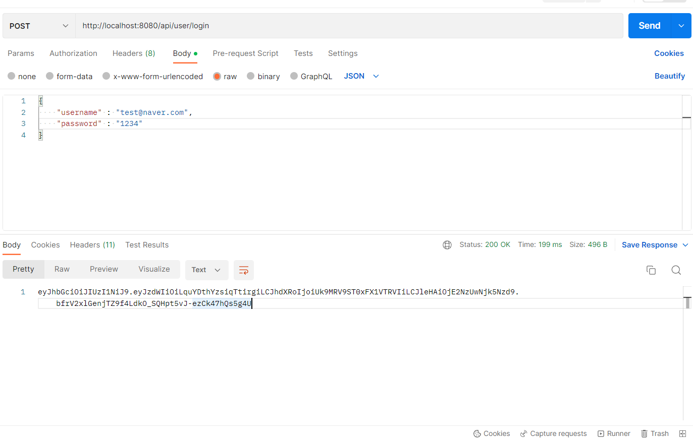
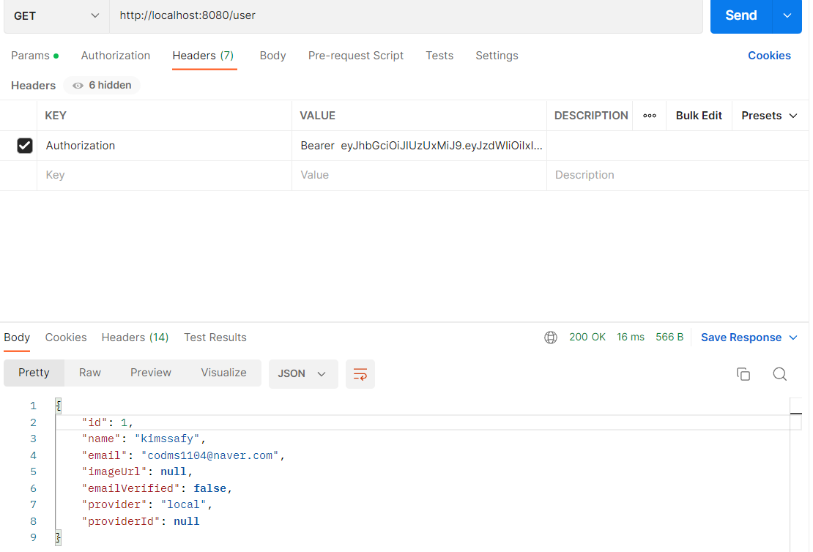

2023-01-18(수)

- 와이어프레임 작성

# 2023-01-19(목)

- 유저플로우 작성
- Oauth 기본원리 숙지
- Oauth 기본기능 구현(구글)
- 

# 2023-01-12(금)

- 스프링 시큐리티 기본 원리 공부
- 스프링 시큐리티 configuration 숙지
- 요구사항명세서 다듬기
- [GitHub - jinwoo-Bae/spring-react-google-oauth2: Google Oauth2 login scenario with Spring boot + React](https://github.com/jinwoo-Bae/spring-react-google-oauth2.git)[GitHub - jinwoo-Bae/spring-react-google-oauth2: Google Oauth2 login scenario with Spring boot + React](https://github.com/jinwoo-Bae/spring-react-google-oauth2.git)

# 2023-01-25(화)

* 레퍼런스 알아보기

* ERD그리기

* 로고제작

* PPT첨삭
  
  # 2023-01-30(월)

* 소셜로그인 백엔드 구현
  

# 2023-02-01(수)

* 사용자 로그인 시 JWT토큰 발급 및 프론트로 전달하는 기능 구현
  앞단에서는 인증이 필요한 요청을 보낼 때 Header의 Authorization에 JWT토큰을 실어서 보내도록 한다.
  
  토큰과 함께 요청을 보내서 정상적으로 리턴이 오는 모습.